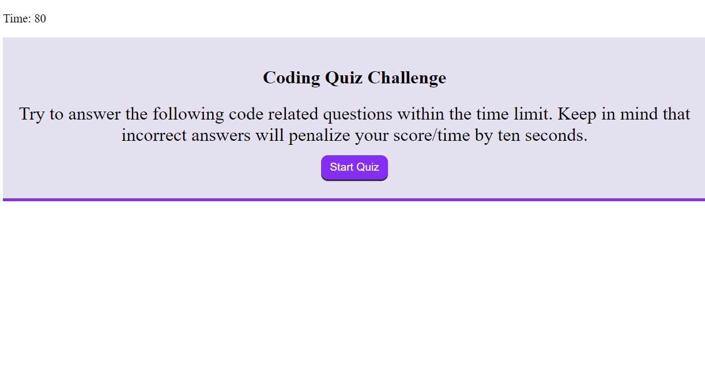

# Quiz
 
## Description

This is my fourth challenge for the UofU bootcamp.  In it you will find a  timed quiz that will will give you a series a questions and multiple choice answers.  Then you will select one and be told if you got it right or wrong.  If wrong you will be deducted 10 seconds of time.  

## What I Learned

Yet again a little bit of everything and a little bit of nothing.  As my second JavaScript project I found this to still be a huge challenge.  The biggest issue this go around was not having enough time.  Without the extra week from the holiday I was unable to get this thing completely  up and running.  I am hoping to chip away at this in the future and bring this up to par.

https://johnknee3.github.io/Quiz/
 